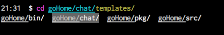
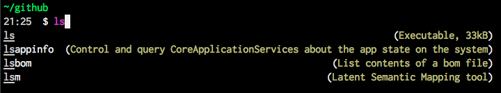
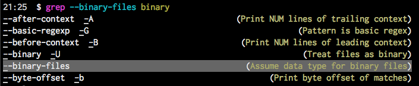

I work a lot in the command line and after some time I heard of zsh (z shell) and fish shell. So, I decided to take a look at both of them and after a while I decided to stay with fish shell. This blog post shows my favorites features of fish shell.

#### Why fish shell?

Fish means friendly interactive shell. It is really friendly, because after I installed it was already working out of the box. It really follows its principle of batteries included. 

After I installed it I just enter the command fish and I was already using it. The user experience on the command line is not really the same after you use fish.

Below I list the features I discovered in fish. I did not need to read the documentation to find the features.

The principles of fish are:

* Batteries included. Without configuration you can start using it.
* Discoverable. You can discover the features while you are using it.

##### Autocompletion
This first feature I was expecting from fish was the autocompletion and it is really amazing. I just tried the *cd* and one letter of the directory I had in mind and it realized the directory contains just one subdirectory and it was offering me that in the autocompletion. After pressing the left arrow I have already the command I wanted with the help of fish.

For changing directories it is not even necessary to write the *cd* command, you can start writing the name of the directory.

##### Completion with multiple options
The next step I discovered was that fish shows all the options the option is not unique. For example, when a directory contains several directories, fish just shows all of them and let you choose the one you want using the arrow keys. 

##### Syntax highlighting
The colors in fish help a lot. The commands and the parameters are colored, so you know when they are correct. For example, when a command does not exist it showed in red.

##### Commands description
The autocompletion works with commands as well. Fish shows as well the multiple similar commands after pressing the TAB key. What I liked was that it shows the description of the commands. Fish gets all the information of the commands from the man pages. That is why Fish can do autocompletion with commands, show possible commands with its description.

##### Discovering command parameters
The autocompletion works as well with commands parameters. Again, that feature is possible because Fish reads that information from the *man* pages and it allows you to navigate through the parameters and select the one you are looking for.

##### Search in history
Something I use a lot is to search in the history, I was used to use the Ctrl+R command. That feature in Fish is easier, for example, I want to search a command containing the word *git*, I just wrote it and I could navigate through the matches using the *Up* and *Down* arrow keys.

#### Configuration
The config file of fish is located in *~/.config/fish/config.fish* . There can be defined aliases or functions or any other configuration. However, for functions it is recommended to create them on the directory *~/.config/fish/functions*. The convention is that every function should have the same file name. E.g the file myList.fish contains the implementation of the function with the same name *myList*, which can be used later in the command line. 

Writing in the command line the command *fish-config* opens a website where a lot of things can be configured, like colors and functions.

#### Conclusion
Fish is a shell that is ready to be used on the daily work. It is a really friendly shell that can be used as it is just after installation. Of course it can be configured according to your needs. There is a project called [Oh my fish](https://github.com/oh-my-fish/oh-my-fish) that has a lot of plugins. 

The scripting language is minimalistic but really comprehensive, you can find a comparison of bash shell and fish shell scripting language in [wikipedia](https://en.wikipedia.org/wiki/Friendly_interactive_shell). And the [fish website](https://fishshell.com/) contains a lot of documentation as well.
